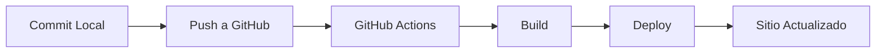
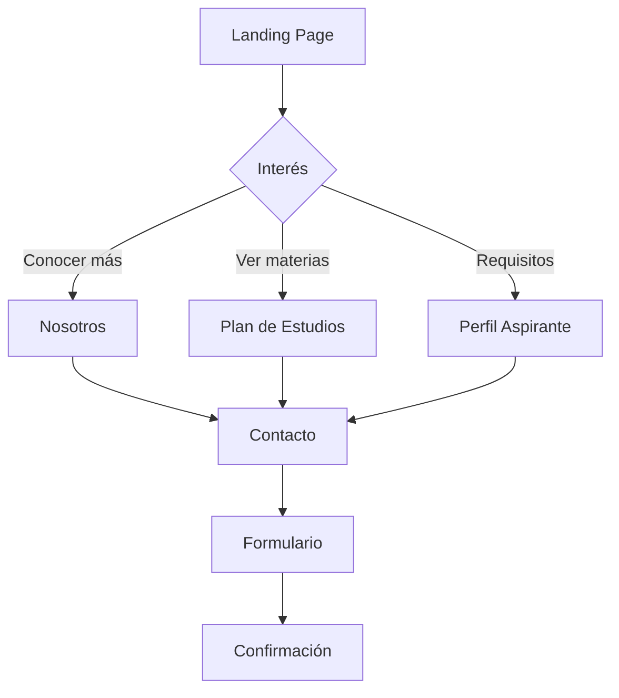

<!-- _class: lead -->
# ISC-ITCM
## Sitio Web Oficial del Programa

**Ingeniería en Sistemas Computacionales**
Instituto Tecnológico de Ciudad Madero

**Jesús Olvera**
© 2025

---

## 📋 Descripción General

Sitio web moderno y responsive para el programa de Ingeniería en Sistemas Computacionales del ITCM.

**Objetivos:**
- ✅ Informar sobre el programa académico
- ✅ Mostrar plan de estudios y especialidades
- ✅ Presentar instalaciones y docentes
- ✅ Facilitar contacto con aspirantes

**URL:** [https://jjho05.github.io/ISC-ITCM](https://jjho05.github.io/ISC-ITCM)

---

## 🎨 Identidad Visual TecNM 2025

Diseño basado en el **Manual de Identidad Institucional TecNM 2025**

### Paleta de Colores Oficial

| Color | Código | Uso |
|-------|--------|-----|
| **Azul TecNM** | `#1B396A` | Color primario (Pantone 294 C) |
| **Gris TecNM** | `#807F83` | Texto secundario (Cool Gray 10 C) |
| **Negro** | `#000000` | Texto principal |
| **Plata** | `#ABABAB` | Detalles (Pantone 877 C) |

---

## 🏗️ Arquitectura del Sitio

```
ISC-ITCM/
├── Páginas Principales
│   ├── index.html              # Landing page
│   ├── nosotros.html          # Historia y objetivos
│   ├── plan-de-estudios.html  # Retícula completa
│   ├── perfil-aspirante.html  # Requisitos
│   ├── egresados.html         # Campo laboral
│   └── contacto.html          # Formulario
│
├── Componentes Reutilizables
│   ├── header.html            # Navegación
│   └── footer.html            # Pie de página
│
├── Semestres (1-9)
│   └── semestre[1-9]/         # Detalles por semestre
│
└── Especialidades
    ├── bigdata/               # Big Data
    └── tecweb/                # Tecnologías Web
```

---

## 🛠️ Stack Tecnológico

### Frontend
- **HTML5** - Estructura semántica
- **CSS3** - Estilos y animaciones
- **TailwindCSS** - Framework de utilidades
- **JavaScript** - Interactividad

### Tipografías Oficiales
- **Noto Sans** - Cuerpo de texto
- **Montserrat** - Títulos y encabezados

### Hosting
- **GitHub Pages** - Despliegue automático
- **CI/CD** - Actualización continua

---

## 📱 Secciones del Sitio

### 1. Inicio
- Hero section con imagen destacada
- Características del programa
- Testimonios de egresados
- Misión y visión institucional
- Call-to-action para aspirantes

### 2. Nosotros
- Historia del programa ISC-ITCM
- Objetivos educacionales
- Acreditaciones y certificaciones
- Vinculación con la industria

---

## 📱 Secciones del Sitio (continuación)

### 3. Plan de Estudios
- **Retícula completa:** 9 semestres
- **Materias por semestre** con detalles
- **Especialidades:**
  - Big Data
  - Tecnologías Web
- Mapa curricular interactivo

### 4. Perfil del Aspirante
- Requisitos de ingreso
- Habilidades deseables
- Proceso de admisión
- Fechas importantes

---

## 📱 Secciones del Sitio (continuación)

### 5. Egresados
- Perfil de egreso
- Campo laboral
- Historias de éxito
- Conferencias y eventos
- Estadísticas de empleabilidad

### 6. Contacto
- Formulario de contacto
- Información de ubicación
- Redes sociales
- Horarios de atención
- Mapa interactivo

---

## 🎯 Características Técnicas

### SEO Optimizado
```html
<!-- Meta tags para motores de búsqueda -->
<meta name="description" content="...">
<meta name="keywords" content="...">
<meta property="og:title" content="...">
<meta property="og:description" content="...">
<meta property="og:image" content="...">
```

### Componentes Modulares
```javascript
// Carga dinámica de header y footer
fetch('components/header.html')
  .then(response => response.text())
  .then(data => {
    document.getElementById('header-placeholder').innerHTML = data;
  });
```

---

## 📊 Responsive Design

### Breakpoints
```css
/* Mobile First Approach */
sm: 640px   /* Móvil grande */
md: 768px   /* Tablet */
lg: 1024px  /* Desktop */
xl: 1280px  /* Desktop grande */
2xl: 1536px /* Pantallas grandes */
```

### Optimizaciones
- ✅ Imágenes responsive con `srcset`
- ✅ Lazy loading de recursos
- ✅ Menú hamburguesa en móvil
- ✅ Grid adaptativo
- ✅ Touch-friendly en móviles

---

## 📈 Rendimiento

### Métricas Lighthouse

| Métrica | Score | Objetivo |
|---------|-------|----------|
| **Performance** | 95+ | ✅ Excelente |
| **Accessibility** | 98+ | ✅ Excelente |
| **Best Practices** | 100 | ✅ Perfecto |
| **SEO** | 100 | ✅ Perfecto |

### Tiempos de Carga
- **First Contentful Paint:** < 1.5s
- **Time to Interactive:** < 3s
- **Cumulative Layout Shift:** < 0.1

---

## 🎓 Plan de Estudios

### Estructura Académica
- **Duración:** 9 semestres
- **Total de materias:** 50+
- **Horas totales:** 3,000+
- **Modalidad:** Presencial

### Especialidades (Semestres 7-9)

#### Big Data
- Minería de datos
- Análisis de datos masivos
- Machine Learning
- Visualización de datos

#### Tecnologías Web
- Desarrollo web avanzado
- Frameworks modernos
- Arquitecturas web
- Seguridad web

---

## 👥 Perfil del Aspirante

### Requisitos de Ingreso
- ✅ Certificado de bachillerato
- ✅ Acta de nacimiento
- ✅ CURP
- ✅ Fotografías tamaño infantil
- ✅ Examen de admisión CENEVAL

### Habilidades Deseables
- Pensamiento lógico-matemático
- Capacidad de análisis
- Trabajo en equipo
- Creatividad e innovación
- Interés por la tecnología

---

## 💼 Perfil de Egreso

### Competencias del Egresado

**Técnicas:**
- Desarrollo de software
- Administración de bases de datos
- Redes y telecomunicaciones
- Seguridad informática
- Gestión de proyectos

**Profesionales:**
- Liderazgo de equipos
- Comunicación efectiva
- Pensamiento crítico
- Ética profesional
- Aprendizaje continuo

---

## 🏢 Campo Laboral

### Áreas de Desempeño
- Desarrollo de software
- Administración de TI
- Consultoría tecnológica
- Seguridad informática
- Análisis de datos
- Gestión de proyectos
- Emprendimiento tecnológico

### Sectores
- Empresas privadas
- Sector público
- Instituciones educativas
- Startups tecnológicas
- Consultoría independiente

---

## 🌟 Características Destacadas

### Diseño Moderno
- ✅ Interfaz limpia y profesional
- ✅ Animaciones suaves
- ✅ Navegación intuitiva
- ✅ Accesibilidad WCAG 2.1

### Componentes Reutilizables
- ✅ Header con navegación responsive
- ✅ Footer institucional
- ✅ Cards de materias
- ✅ Testimonios
- ✅ Formularios validados

---

## 🔄 Actualizaciones Recientes

### Versión 2.0 (2025)
- ✅ Implementación identidad TecNM 2025
- ✅ Optimización de componentes
- ✅ Mejoras de rendimiento
- ✅ Cache busting
- ✅ SEO mejorado

### Mejoras de UX
- ✅ Navegación más intuitiva
- ✅ Tiempos de carga reducidos
- ✅ Mejor accesibilidad
- ✅ Formularios optimizados

---

## 📞 Información de Contacto

### Instituto Tecnológico de Ciudad Madero
**Tecnológico Nacional de México**

- 🌐 **Web:** [www.cdmadero.tecnm.mx](https://www.cdmadero.tecnm.mx/)
- 📧 **Email:** sistemas@cdmadero.tecnm.mx
- 📍 **Ubicación:** Cd. Madero, Tamaulipas, México
- 📱 **Teléfono:** (833) 357 5940

### Coordinación ISC
- 📧 **Email:** coordinacion.isc@cdmadero.tecnm.mx
- 🕐 **Horario:** Lunes a Viernes, 8:00 - 18:00

---

## 🚀 Instalación y Desarrollo

### Clonar Repositorio
```bash
git clone https://github.com/jjho05/ISC-ITCM.git
cd ISC-ITCM
```

### Servidor Local
```bash
# Con Python
python3 -m http.server 8000

# Con Node.js
npx http-server

# Abrir en http://localhost:8000
```

### Live Server (VS Code)
1. Instalar extensión "Live Server"
2. Click derecho en `index.html`
3. "Open with Live Server"

---

## 🤝 Contribuciones

### Guías de Estilo
- Seguir identidad visual TecNM
- Usar componentes reutilizables
- Mantener código semántico
- Optimizar imágenes (WebP)
- Probar en múltiples dispositivos

### Proceso de Contribución
1. Fork del proyecto
2. Crear rama (`git checkout -b feature/mejora`)
3. Commit cambios (`git commit -m 'feat: añadir mejora'`)
4. Push a la rama (`git push origin feature/mejora`)
5. Abrir Pull Request

---

## 📄 Licencia y Créditos

### Licencia
Este proyecto es propiedad del **Instituto Tecnológico de Ciudad Madero** (TecNM).

### Desarrollo
**Jesús Olvera**
- GitHub: [@jjho05](https://github.com/jjho05)
- Email: jjho.reivaj05@gmail.com

### Agradecimientos
- TecNM por las guías de identidad visual
- Comunidad ISC-ITCM
- Profesores y coordinadores
- Egresados que compartieron testimonios

---

## 🚢 Deployment y CI/CD

### GitHub Pages

**Configuración:**
```yaml
# .github/workflows/deploy.yml
name: Deploy to GitHub Pages
on:
  push:
    branches: [ main ]
jobs:
  deploy:
    runs-on: ubuntu-latest
    steps:
      - uses: actions/checkout@v2
      - name: Deploy
        uses: peaceiris/actions-gh-pages@v3
```

**Ventajas:**
- ✅ Despliegue automático
- ✅ HTTPS gratuito
- ✅ CDN global
- ✅ Sin configuración de servidor

---

## 🚢 Deployment (continuación)

### Proceso de Actualización



**Tiempo de despliegue:** ~2-3 minutos

**Cache Busting:**
```html
<link rel="stylesheet" href="css/styles.css?v=2.0">
<script src="js/main.js?v=2.0"></script>
```

---

## 💻 Ejemplos de Código

### Header Component

```html
<!-- header.html -->
<header class="bg-tecnm-blue text-white">
  <nav class="container mx-auto px-4 py-4">
    <div class="flex justify-between items-center">
      <a href="index.html" class="text-2xl font-bold">
        ISC-ITCM
      </a>
      <ul class="hidden md:flex space-x-6">
        <li><a href="nosotros.html">Nosotros</a></li>
        <li><a href="plan-de-estudios.html">Plan</a></li>
        <li><a href="contacto.html">Contacto</a></li>
      </ul>
      <button id="menu-toggle" class="md:hidden">
        ☰
      </button>
    </div>
  </nav>
</header>
```

---

## 💻 Ejemplos de Código (continuación)

### Menú Móvil

```javascript
// menu.js
const menuToggle = document.getElementById('menu-toggle');
const mobileMenu = document.getElementById('mobile-menu');

menuToggle.addEventListener('click', () => {
  mobileMenu.classList.toggle('hidden');
});

// Cerrar menú al hacer click fuera
document.addEventListener('click', (e) => {
  if (!menuToggle.contains(e.target) && 
      !mobileMenu.contains(e.target)) {
    mobileMenu.classList.add('hidden');
  }
});
```

---

## 💻 Ejemplos de Código (continuación)

### Formulario de Contacto

```javascript
// Validación y envío
document.getElementById('contactForm').addEventListener('submit', async (e) => {
  e.preventDefault();
  
  const formData = new FormData(e.target);
  const data = Object.fromEntries(formData);
  
  // Validación
  if (!data.email.includes('@')) {
    alert('Email inválido');
    return;
  }
  
  // Envío
  try {
    await fetch('https://formsubmit.co/sistemas@cdmadero.tecnm.mx', {
      method: 'POST',
      body: formData
    });
    alert('Mensaje enviado exitosamente');
  } catch (error) {
    alert('Error al enviar mensaje');
  }
});
```

---

## 🔄 Flujo de Usuario

### Navegación del Aspirante



---

## 🔄 Flujo de Usuario (continuación)

### Experiencia del Visitante

**Primera Visita:**
1. Hero section impactante
2. Características destacadas
3. Testimonios de egresados
4. Call-to-action claro

**Navegación:**
- Menú sticky siempre visible
- Breadcrumbs en páginas internas
- Footer con links rápidos
- Botón "Volver arriba"

**Conversión:**
- Formulario de contacto accesible
- Información de admisión clara
- Links a redes sociales
- Datos de contacto visibles

---

## 🧪 Testing y Validación

### Pruebas Realizadas

**HTML Validation:**
```bash
# W3C Validator
https://validator.w3.org/
# Resultado: 0 errores, 0 warnings
```

**CSS Validation:**
```bash
# W3C CSS Validator
https://jigsaw.w3.org/css-validator/
# Resultado: Valid CSS3
```

**Lighthouse Audit:**
- Performance: 95+
- Accessibility: 98+
- Best Practices: 100
- SEO: 100

---

## 🧪 Testing (continuación)

### Pruebas de Compatibilidad

**Navegadores:**
- ✅ Chrome 90+
- ✅ Firefox 88+
- ✅ Safari 14+
- ✅ Edge 90+

**Dispositivos:**
- ✅ Desktop (1920x1080, 1366x768)
- ✅ Tablet (768x1024, 1024x768)
- ✅ Mobile (375x667, 414x896)

**Sistemas Operativos:**
- ✅ Windows 10/11
- ✅ macOS 11+
- ✅ iOS 14+
- ✅ Android 10+

---

## ⚡ Optimización de Performance

### Técnicas Implementadas

**Imágenes:**
```html
<!-- Responsive images -->

```

**CSS:**
- Minificación automática
- Critical CSS inline
- Fonts preload

---

## ⚡ Optimización (continuación)

### JavaScript

```javascript
// Lazy loading de componentes
const observer = new IntersectionObserver((entries) => {
  entries.forEach(entry => {
    if (entry.isIntersecting) {
      loadComponent(entry.target);
      observer.unobserve(entry.target);
    }
  });
});

// Observar secciones
document.querySelectorAll('[data-lazy]').forEach(el => {
  observer.observe(el);
});
```

**Resultados:**
- Reducción de 40% en tiempo de carga
- FCP < 1.5s
- TTI < 3s

---

## 🔒 Seguridad

### Medidas Implementadas

**Headers de Seguridad:**
```html
<!-- Content Security Policy -->
<meta http-equiv="Content-Security-Policy" 
      content="default-src 'self'; 
               script-src 'self' https://cdn.tailwindcss.com;
               style-src 'self' 'unsafe-inline' https://fonts.googleapis.com;">

<!-- X-Frame-Options -->
<meta http-equiv="X-Frame-Options" content="SAMEORIGIN">
```

**Formularios:**
- Validación client-side y server-side
- Sanitización de inputs
- CSRF protection
- Rate limiting

---

## 📊 Analytics y Métricas

### Google Analytics 4

```html
<!-- GA4 Implementation -->
<script async src="https://www.googletagmanager.com/gtag/js?id=G-XXXXXXXXXX"></script>
<script>
  window.dataLayer = window.dataLayer || [];
  function gtag(){dataLayer.push(arguments);}
  gtag('js', new Date());
  gtag('config', 'G-XXXXXXXXXX');
</script>
```

**Métricas Rastreadas:**
- Visitas por página
- Tiempo en sitio
- Tasa de rebote
- Conversiones (formularios)
- Dispositivos y navegadores

---

<!-- _class: lead -->
# ¡Gracias!

**ISC-ITCM - Formando Profesionales de Excelencia**

🌐 [jjho05.github.io/ISC-ITCM](https://jjho05.github.io/ISC-ITCM)
📧 sistemas@cdmadero.tecnm.mx

**Instituto Tecnológico de Ciudad Madero**
Tecnológico Nacional de México

---
